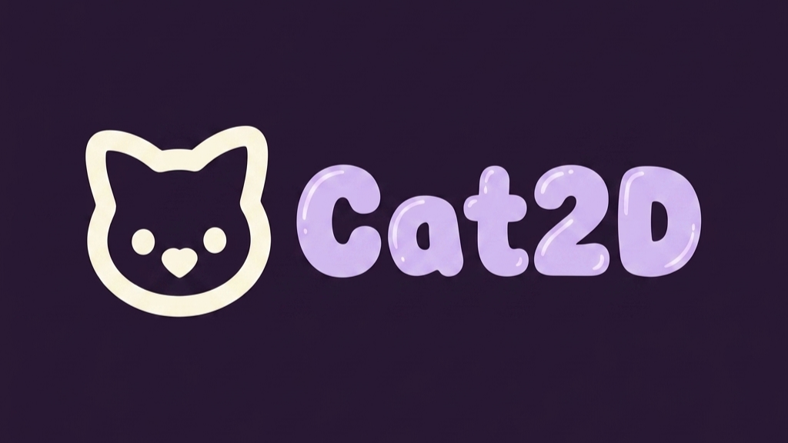

# <p align="center">Cat Engine</p>

<p align="center">
  
</p>

<p align="center">
<strong>A Engine Lua para Android criada para remover limites.</strong><br>
Desenvolvida em Lua e C++, a Cat Engine combina desempenho, simplicidade e evolução guiada pela comunidade para tornar possível a criação de jogos mobile verdadeiramente ambiciosos.
</p>

<p align="center">
  <a href="https://catengine.netlify.app/">Site Oficial</a>
  •
  <a href="https://discord.gg/CwEnEA9RwR">Discord Oficial</a>
  •
  <a href="https://youtu.be/BUzkJsXwzSI">YouTube Oficial</a>
  

---

<p align="center">
  
</p>

<p align="center">
<em>Projetada para levar o desenvolvimento mobile além das limitações tradicionais.</em>
</p>

---

# O que é a Cat Engine?

A Cat Engine é uma engine de jogos desenvolvida exclusivamente para Android.

Ela nasceu da ideia de que criar jogos para dispositivos móveis não deveria significar abrir mão de desempenho, liberdade criativa ou recursos avançados.

Seu propósito é remover limitações frequentemente encontradas em frameworks mobile tradicionais, oferecendo uma experiência simples para iniciantes e poderosa para desenvolvedores experientes.

Projetada especificamente para o ecossistema Android, a Cat Engine busca unir facilidade de uso, integração nativa e um núcleo altamente otimizado capaz de acompanhar projetos cada vez mais ambiciosos.

---

# Filosofia

Acreditamos que uma engine deve evoluir junto com quem a utiliza.

A Cat Engine é desenvolvida ouvindo sua comunidade, entendendo os desafios enfrentados pelos criadores e transformando essas necessidades em melhorias reais.

Nosso compromisso é construir uma tecnologia que seja:

- Simples de aprender;
- Poderosa quando necessário;
- Transparente em sua documentação;
- Adaptada às necessidades reais do desenvolvimento mobile;
- Livre das limitações encontradas em soluções tradicionais;
- Preparada para acompanhar projetos de qualquer porte.

---

# Tecnologias Utilizadas

A simplicidade da API é sustentada por tecnologias consolidadas e altamente eficientes.

## Linguagem da API

- Lua

## Núcleo da Engine

- C++

## Renderização

- OpenGL ES 3.2
- GLSL ES (Shaders)

## Física

- Chipmunk2D

## Integração com o Sistema

- Android Native APIs
- JNI

---

# Recursos

## Renderização Moderna

A Cat Engine oferece um sistema gráfico otimizado para Android, permitindo o desenvolvimento de interfaces, efeitos visuais e cenas complexas com excelente desempenho.

Entre os recursos disponíveis estão:

- Renderização de texturas;
- Fontes e efeitos de texto;
- Canvas;
- FastBatch;
- 9-Slice;
- Sistema de Shaders;
- OpenGL de baixo nível;
- Sistema experimental 3D.

---

## Física

Baseada na biblioteca Chipmunk2D, a engine fornece um conjunto completo de ferramentas para simulações estáveis e previsíveis.

Incluindo:

- Corpos rígidos;
- Colisões;
- Raycasts;
- Constraints;
- Callbacks de colisão;
- Consultas espaciais.

---

## Recursos Nativos do Android

Por ter sido desenvolvida especificamente para Android, a Cat Engine possui integração com diversos recursos do próprio sistema operacional.

Entre eles:

- Multitoque;
- Gestos;
- Vibração;
- Sensores do dispositivo;
- Teclado virtual;
- Seleção de arquivos;
- Recursos nativos do Android.

---

## Sistemas Avançados

Além das funcionalidades essenciais, a engine inclui sistemas auxiliares que aceleram o desenvolvimento.

Como:

- ECS (Entity Component System);
- Eventos e Plugins;
- Tween;
- Async;
- Threads;
- JSON;
- Spatial Hash;
- Sistema de partículas;
- Joystick virtual;
- Ferramentas utilitárias.

---

# Como a Cat Engine Funciona

A experiência do desenvolvedor é construída sobre Lua, proporcionando produtividade, simplicidade e rapidez durante a criação do jogo.

Por trás dessa camada acessível existe um núcleo escrito em C++, responsável pelo processamento intensivo e otimizações críticas.

A renderização é realizada através do OpenGL ES 3.2, utilizando eficientemente a GPU disponível nos dispositivos Android modernos.

O sistema físico utiliza Chipmunk2D para garantir precisão e estabilidade, enquanto a integração com APIs nativas permite acesso direto às funcionalidades do dispositivo.

O resultado é uma engine criada especificamente para o ambiente mobile, preparada para atender desde projetos independentes até experiências significativamente mais ambiciosas.

---

# Documentação

Toda a documentação oficial está disponível na pasta:

```text
docs/
```

A documentação foi desenvolvida para responder rapidamente às dúvidas mais comuns durante o desenvolvimento.

Cada módulo explica:

- O que ele faz;
- Como deve ser utilizado;
- Parâmetros e retornos;
- Situações de uso incorreto;
- Recomendações;
- Boas práticas.

Caso esteja começando, recomendamos iniciar por:

```text
docs/index.md
```

---

# Downloads

As versões oficiais da Cat Engine são distribuídas através da seção Releases deste repositório.

Cada lançamento poderá incluir:

- APKs para Android;
- Histórico de alterações;
- Correções e melhorias;
- Novos recursos;
- Informações sobre compatibilidade.

---

# Comunidade

A evolução da Cat Engine é influenciada pelas experiências de seus usuários.

Se você encontrou um problema, possui sugestões ou deseja compartilhar ideias para futuras versões, utilize a área de Issues deste repositório ou participe dos canais oficiais da comunidade.

A participação da comunidade é um dos pilares deste projeto.

---

# Sobre o Projeto

A Cat Engine é uma tecnologia proprietária.

O código-fonte da engine não é disponibilizado publicamente.

Este repositório existe com o objetivo de fornecer:

- Documentação oficial;
- Informações sobre atualizações;
- Materiais de apresentação;
- Downloads autorizados;
- Canais oficiais de comunicação.

---

# Direitos Autorais

Cat Engine é uma tecnologia proprietária.

Todos os direitos reservados.

© Gollow. Todos os direitos reservados.

---

<p align="center">
Desenvolvida para criadores que acreditam que jogos mobile podem ir além.
</p>
