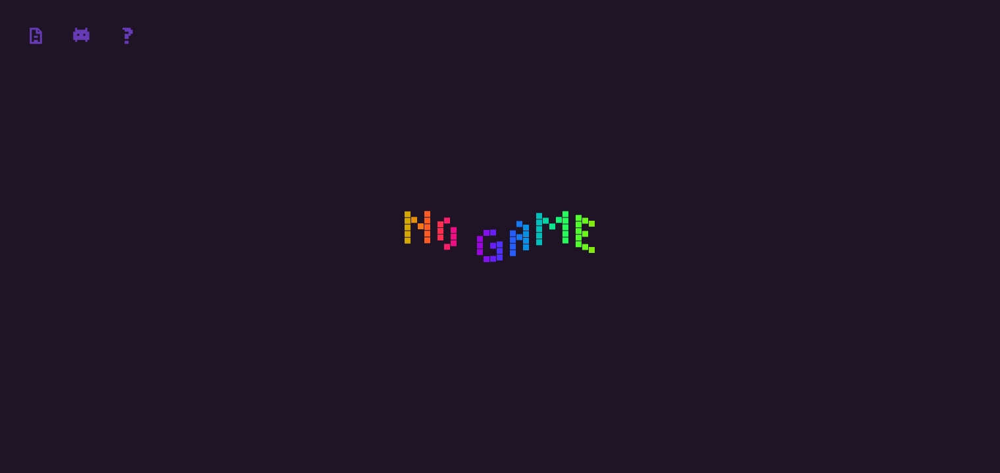
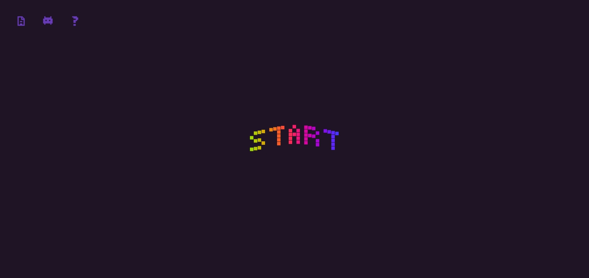
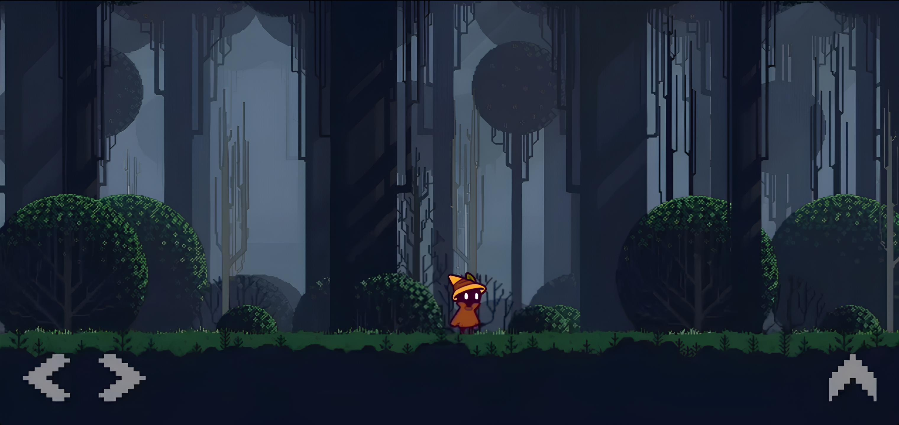

<div align="center">

<!--
  📌 BANNER (remova este comentário depois):
  Imagem larga (sugestão: 1280x640px ou 1200x300px), com o logo/nome da engine,
  salva em assets/banner.png. É a primeira coisa que quem abre o repositório vê.
-->


# 🐾 Cat Engine

### A Engine Lua para Android criada para remover limites.

Desenvolvida em **Lua** e **C++**, a Cat Engine combina desempenho, simplicidade e evolução guiada pela comunidade para tornar possível a criação de jogos mobile verdadeiramente ambiciosos.

[](#)
[](#)
[](#)
[](#)
[](#)

**[🌎 Site Oficial](#) • [🗨 Discord Oficial](#) • [📍 YouTube Oficial](#)**

</div>

---

<!--
  📌 GIF DE DEMONSTRAÇÃO (remova este comentário depois):
  Um GIF curto (5-10s) mostrando o Loader abrindo um jogo de exemplo rodando.
  Salve em assets/demo.gif. Ferramentas como ScreenToGif ou um gravador de tela
  do Android + conversor online resolvem isso rápido.
-->
<div align="center">
  
  <p><em>O Loader abrindo e executando um projeto da pasta catgame/.</em></p>
</div>

---

<!--
  📌 SCREENSHOT DA INTERFACE (remova este comentário depois):
  Captura de tela estática da tela principal do Loader, salva em assets/interface.png.
-->
<div align="center">
  
  <p><em>A interface do Loader: selecione e rode seu projeto em catgame/ com um toque.</em></p>
</div>

---

## 📑 Sumário

- [O que é a Cat Engine?](#-o-que-é-a-cat-engine)
- [Filosofia](#-filosofia)
- [Tecnologias Utilizadas](#-tecnologias-utilizadas)
- [Recursos](#-recursos)
- [Como Funciona](#-como-a-cat-engine-funciona)
- [Primeiros Passos](#-primeiros-passos)
  - [Estrutura de Pastas](#estrutura-de-pastas)
  - [O Loader](#o-loader)
  - [Ciclo de Vida do Jogo](#ciclo-de-vida-do-jogo)
- [Exemplos de Código](#-exemplos-de-código)
- [Documentação](#-documentação)
- [Downloads](#-downloads)
- [Comunidade](#-comunidade)
- [Sobre o Projeto](#-sobre-o-projeto)
- [Direitos Autorais](#-direitos-autorais)

---

## 🐱 O que é a Cat Engine?

A **Cat Engine** é uma engine de jogos desenvolvida exclusivamente para **Android**. Ela nasceu da ideia de que criar jogos para dispositivos móveis não deveria significar abrir mão de desempenho, liberdade criativa ou recursos avançados.

Seu propósito é remover limitações frequentemente encontradas em frameworks mobile tradicionais, oferecendo uma experiência simples para iniciantes e poderosa para desenvolvedores experientes.

Projetada especificamente para o ecossistema Android, a Cat Engine busca unir facilidade de uso, integração nativa e um núcleo altamente otimizado, capaz de acompanhar projetos cada vez mais ambiciosos.

## 🧭 Filosofia

Acreditamos que uma engine deve evoluir junto com quem a utiliza. A Cat Engine é desenvolvida ouvindo sua comunidade, entendendo os desafios enfrentados pelos criadores e transformando essas necessidades em melhorias reais.

Nosso compromisso é construir uma tecnologia que seja:

- ✅ Simples de aprender
- ✅ Poderosa quando necessário
- ✅ Transparente em sua documentação
- ✅ Adaptada às necessidades reais do desenvolvimento mobile
- ✅ Livre das limitações encontradas em soluções tradicionais
- ✅ Preparada para acompanhar projetos de qualquer porte

## 🛠 Tecnologias Utilizadas

A simplicidade da API é sustentada por tecnologias consolidadas e altamente eficientes.

| Camada | Tecnologia |
|---|---|
| Linguagem da API | Lua |
| Núcleo da Engine | C++ |
| Renderização | OpenGL ES 3.2 + GLSL ES (Shaders) |
| Física | Chipmunk2D |
| Integração com o Sistema | Android Native APIs + JNI |

## ✨ Recursos

### 🎨 Renderização Moderna

A Cat Engine oferece um sistema gráfico otimizado para Android, permitindo o desenvolvimento de interfaces, efeitos visuais e cenas complexas com excelente desempenho:

- Renderização de texturas
- Fontes e efeitos de texto
- Canvas
- `FastBatch` para milhares de formas instanciadas em uma única chamada
- 9-Slice
- Sistema de Shaders (GLSL)
- OpenGL ES de baixo nível, acessível diretamente via `gl`
- Sistema experimental 3D (`Engine3D`, `Retro3D`)

### 🌍 Física

Baseada na biblioteca **Chipmunk2D**, a engine fornece um conjunto completo de ferramentas para simulações estáveis e previsíveis, incluindo:

- Corpos rígidos, estáticos e cinemáticos
- Shapes (caixa, círculo, segmento, polígono)
- Colisões com callbacks (`addCollisionHandler`)
- Raycasts e consultas espaciais (`pointQuery`, `bbQuery`)
- Constraints e Joints (pinos, molas, motores)

### 📱 Recursos Nativos do Android

Por ter sido desenvolvida especificamente para Android, a Cat Engine possui integração com diversos recursos do próprio sistema operacional:

- Multitoque
- Gestos (pinça, rotação, fling, double tap, swipe)
- Vibração e Haptics
- Sensores do dispositivo (acelerômetro, giroscópio)
- Teclado virtual com pan automático de câmera
- Seleção de arquivos e área de transferência
- Notificações nativas agendadas

### ⚙️ Sistemas Avançados

Além das funcionalidades essenciais, a engine inclui sistemas auxiliares que aceleram o desenvolvimento:

- ECS (Entity Component System)
- Eventos e Plugins
- Tween
- Async e Threads (corrotinas com `sleep`, `wait_until`, `tween`)
- JSON
- Spatial Hash
- Sistema de partículas
- Joystick virtual
- Ferramentas utilitárias (`Utils`)

## 🔩 Como a Cat Engine Funciona

A experiência do desenvolvedor é construída sobre **Lua**, proporcionando produtividade, simplicidade e rapidez durante a criação do jogo. Por trás dessa camada acessível existe um núcleo escrito em **C++**, responsável pelo processamento intensivo e otimizações críticas.

A renderização é realizada através do **OpenGL ES 3.2**, utilizando eficientemente a GPU disponível nos dispositivos Android modernos. O sistema físico utiliza **Chipmunk2D** para garantir precisão e estabilidade, enquanto a integração com APIs nativas permite acesso direto às funcionalidades do dispositivo.

A própria Cat Engine, instalada no aparelho, funciona como um **Loader**: um app com uma interface simples e direta que localiza e executa o seu jogo a partir da pasta `catgame/`, sem necessidade de compilar um APK próprio a cada teste.

O resultado é uma engine criada especificamente para o ambiente mobile, preparada para atender desde projetos independentes até experiências significativamente mais ambiciosas.

---

## 🚀 Primeiros Passos

### Estrutura de Pastas

Para que um jogo funcione na Cat Engine, ele precisa de uma estrutura de pastas e arquivos específica dentro do armazenamento do seu celular. A pasta principal que a engine lê é a `catload/catgame/`:

```text
/storage/emulated/0/catload/catgame/
 ├── main.lua                <-- Obrigatório! O ponto de entrada do seu jogo.
 ├── catconfig/
 │    └── conf.lua           <-- Arquivo de configuração global da engine.
 ├── imagens/                <-- (Opcional) Crie pastas para organizar recursos.
 │    └── player.png
 └── sons/                   <-- (Opcional) Outra pasta para seus recursos.
```

- **`main.lua`** — Sem este arquivo, o jogo não carrega. É nele que você define as funções `load()`, `update(dt)` e `draw()`. Tudo começa por aqui.
- **`catconfig/conf.lua`** — Arquivo de configurações especiais, lido **antes** mesmo da janela do jogo abrir. Ao contrário do `main.lua`, que roda o seu código de jogo, o `conf.lua` serve para configurar o "motor" da engine: orientação da tela (retrato ou paisagem), nível de anti-aliasing e quais bibliotecas padrão devem ser injetadas no projeto.

> 💡 **Como rodar:** basta colocar a pasta `catgame/` dentro de `catload/` no armazenamento do dispositivo e abrir o app **Cat Engine**. O Loader detecta o projeto automaticamente e o inicia — sem necessidade de gerar um APK separado a cada teste.

### O Loader

O app da Cat Engine instalado no Android não é apenas um motor invisível: ele é também um **Loader**, com uma interface simples que permite:

- Localizar o projeto dentro de `catload/catgame/`
- Iniciar o jogo com um toque
- Exibir logs e informações básicas de execução durante o desenvolvimento

<div align="center">
  
  
</div>

### Ciclo de Vida do Jogo

Os jogos da Cat Engine são orientados a estado. Se o núcleo em C++ encontrar estas funções globais no seu `main.lua`, elas serão chamadas automaticamente para montar o Game Loop da sua aplicação:

| Função | Quando roda | Para que serve |
|---|---|---|
| `load()` | Uma única vez, na abertura do jogo | Carregar texturas, sons e configurações iniciais |
| `update(dt)` | Repetidamente, a cada frame | Lógica de jogo, movimentação, física, input |
| `draw()` | Repetidamente, após o `update` | Desenhar tudo na tela usando `graphics` |

O parâmetro `dt` (Delta Time) entrega o tempo exato, em segundos, que se passou desde o frame anterior — essencial para que a movimentação não varie entre aparelhos de 60Hz, 120Hz ou 144Hz.

```lua
local x = 0
local tex

function load()
    -- Carregamento único, em tempo zero.
    tex = graphics.loadTexture("player.png")
end

function update(dt)
    -- Movimentação independente da taxa de quadros, usando Delta Time.
    x = x + (100 * dt)
end

function draw()
    graphics.draw(tex, x, 100, 0, 1, 1)
end
```

> ⚠️ **Boa prática:** nunca chame `graphics.loadTexture()` ou `audio.loadSound()` dentro de `update()` ou `draw()`. Carregue tudo uma única vez em `load()` — fazer isso dentro do loop destrói o FPS e pode causar estouro de memória.

---

## 💻 Exemplos de Código

Abaixo, alguns trechos reais usando módulos centrais da API para você ter uma ideia do estilo de código da Cat Engine.

### Desenhando e animando um sprite

```lua
local img_nave = graphics.loadTexture("assets/nave.png")
local angulo = 0

function update(dt)
    angulo = angulo + (1.5 * dt)
end

function draw()
    -- graphics.draw(img, x, y, angulo_radianos, escalaX, escalaY)
    graphics.draw(img_nave, 200, 200, angulo, 1, 1)
end
```

### Entrada de toque (touch)

```lua
function update(dt)
    if input.isJustTouched() then
        local tx = input.getTouchX()
        local ty = input.getTouchY()
        player.atirarPara(tx, ty)
    end
end
```

### Vetores 2D nativos (`vec2`)

```lua
local gravidade = vec2(0, 9.8)
local player_pos = vec2(100, 100)
local player_velocidade = vec2(0, 0)

function update(dt)
    -- Operadores In-Place evitam criar novos objetos a cada frame.
    player_velocidade:addInPlace(gravidade)
    player_pos:addInPlace(player_velocidade)
end
```

### Matemática utilitária

```lua
-- Distância entre dois pontos
if math.distance(player.x, player.y, enemy.x, enemy.y) < 150 then
    enemy:atacar()
end

-- Limitar a vida do jogador entre 0 e 100
vidaJogador = math.clamp(vidaJogador - danoSofrido, 0, 100)
```

### Corrotinas com `thread` (assíncrono sem travar o loop)

```lua
thread.start(function()
    system.log("Inimigo começou a patrulhar!")
    thread.tween(inimigo, 3.0, inimigo.x + 100, inimigo.y)
    thread.sleep(1.0)
    thread.tween(inimigo, 3.0, inimigo.x - 100, inimigo.y)
end)
```

### Física: colisão entre jogador e moeda

```lua
local TIPO_JOGADOR = 1
local TIPO_MOEDA = 2

shape_jogador:setCollisionType(TIPO_JOGADOR)
shape_moeda:setCollisionType(TIPO_MOEDA)

local function aoPegarMoeda(shapeA, shapeB, contatos)
    system.log("Player tocou na moeda!")
    return false -- impede o rebote físico (a moeda é um sensor)
end

meu_mundo:addCollisionHandler(TIPO_JOGADOR, TIPO_MOEDA, aoPegarMoeda, nil, nil, nil)
```

### Salvando progresso com JSON

```lua
local save_data = { coins = 500, checkpoint = 3 }
fs.write(fs.savePath .. "/meusave.json", json.encode(save_data))

if fs.exists(fs.savePath .. "/meusave.json") then
    local texto = fs.read(fs.savePath .. "/meusave.json")
    local progresso = json.decode(texto)
    system.log("Moedas salvas: " .. progresso.coins)
end
```

### Renderizando milhares de partículas com `FastBatch`

```lua
local mega_chuva = graphics.newFastBatch(10000)

function load()
    for i = 1, 5000 do
        mega_chuva:add(math.random(0, 800), 0, 4, 4, 0.4, 0.6, 1, 1, 0, 200)
    end
end

function update(dt)
    mega_chuva:update(dt, graphics.getWidth(), graphics.getHeight())
end

function draw()
    mega_chuva:draw()
end
```

---

## 📚 Documentação

Toda a documentação oficial está disponível na pasta:

```text
docs/
```

Ela foi desenvolvida para responder rapidamente às dúvidas mais comuns durante o desenvolvimento. Cada módulo explica:

- O que ele faz
- Como deve ser utilizado
- Parâmetros e retornos
- Situações de uso incorreto
- Recomendações e boas práticas

Alguns pontos de partida recomendados:

| Módulo | Descrição |
|---|---|
| [`docs/index.md`](docs/index.md) | Ponto de partida — guia de início rápido e arquitetura de projeto |
| [`docs/tutorial.md`](docs/tutorial.md) | Rotação de sprites, animações por frames e por spritesheet |
| [`docs/graphics.md`](docs/graphics.md) | Texturas, formas, canvas e desenho na tela |
| [`docs/input.md`](docs/input.md) | Touch, teclado virtual e sensores |
| [`docs/physics.md`](docs/physics.md), [`physics_advanced.md`](docs/physics_advanced.md), [`physics_collisions.md`](docs/physics_collisions.md) | Corpos rígidos, joints, raycasts e colisões |
| [`docs/math.md`](docs/math.md), [`math_advanced.md`](docs/math_advanced.md) | Funções matemáticas, vetores, ruído e matrizes |
| [`docs/vector2.md`](docs/vector2.md) | Objeto `vec2` nativo de alta performance |
| [`docs/thread.md`](docs/thread.md) | Corrotinas e assincronia (sleep, wait_until, tween) |
| [`docs/system.md`](docs/system.md) | Tempo, armazenamento leve, hardware e GC |
| [`docs/json.md`](docs/json.md) | Codificação e decodificação de dados JSON |
| [`docs/fast_batch.md`](docs/fast_batch.md) | Renderização em massa de formas não-texturizadas |
| [`docs/gl_lowlevel.md`](docs/gl_lowlevel.md) | Acesso direto ao OpenGL ES (baixo nível) |
| [`docs/utils.md`](docs/utils.md) | Ferramentas utilitárias diversas |
| [`api_reference.txt`](api_reference.txt) | Lista rápida com as assinaturas completas de cada função da engine |

Caso esteja começando, recomendamos iniciar por **[`docs/index.md`](docs/index.md)**.

---

## 📦 Downloads

As versões oficiais da Cat Engine são distribuídas através da seção [**Releases**](../../releases) deste repositório. Cada lançamento poderá incluir:

- APKs para Android
- Histórico de alterações
- Correções e melhorias
- Novos recursos
- Informações sobre compatibilidade

## 👥 Comunidade

A evolução da Cat Engine é influenciada pelas experiências de seus usuários. Se você encontrou um problema, possui sugestões ou deseja compartilhar ideias para futuras versões, utilize a área de [**Issues**](../../issues) deste repositório ou participe dos canais oficiais da comunidade.

A participação da comunidade é um dos pilares deste projeto.

## ℹ️ Sobre o Projeto

A Cat Engine é uma tecnologia **proprietária**. O código-fonte da engine não é disponibilizado publicamente. Este repositório existe com o objetivo de fornecer:

- Documentação oficial
- Informações sobre atualizações
- Materiais de apresentação
- Downloads autorizados
- Canais oficiais de comunicação

## ©️ Direitos Autorais

Cat Engine é uma tecnologia proprietária. Todos os direitos reservados.

**© Gollow. Todos os direitos reservados.**

---

<div align="center">

*Desenvolvida para criadores que acreditam que jogos mobile podem ir além.*

</div>
